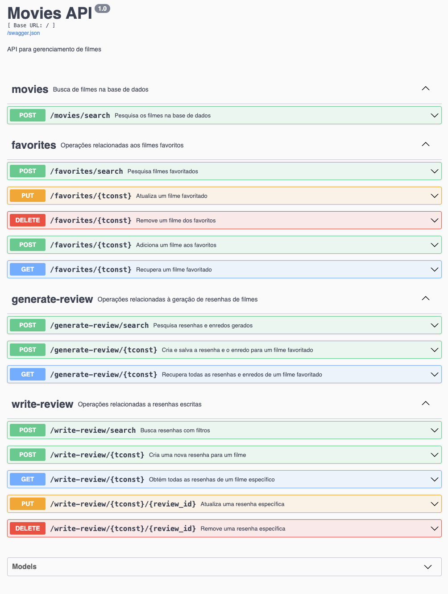

# 🎬 movie-search-backend
 
## 📑 Índice
- [Visão Geral](#-movie-search-backend)
  - [API](#2-rotas-de-consulta)
  - [Documentação da API (Open API / Swagger)](#3-documentação-da-api-swagger)
- [Como Testar](#como-testar-requisições-no-swagger-ui)
- [Instalação e Configuração](#instalação-e-configuração)
  - [Configuração do Ambiente](#1-crie-e-ative-um-ambiente-virtual-e-instale-as-dependências)
  - [Variáveis de Ambiente](#2-configure-as-variáveis-de-ambiente)
- [Rodando o Projeto](#rodando-o-projeto)
- [Tech Stack](#tech-stack)
- [Estrutura do Projeto](#estrutura-do-projeto)

---

## Visão Geral


> Este projeto, construído em Python, [é o backend do projeto MOVIE-SEARCH](https://github.com/francisdiasbr/movie-search-frontend). Para entender o projeto completo, acesse o repositório do [frontend](https://github.com/francisdiasbr/movie-search-frontend).


> Observação: As resenhas geradas são utilizadas para alimentar o Blog The Movie Search (https://themoviesearchblog.netlify.app/)


## 🛠️ Frameworks e Bibliotecas Principais

- Flask: Framework web para construção da API
- Flask-RESTX: Extensão para desenvolvimento de APIs RESTful com Swagger UI integrado
- Swagger: Documentação interativa da API

## 🗄️ Banco de Dados

- MongoDB: Banco de dados NoSQL para persistência de dados

## 🔌 Integrações com APIs Externas

- OpenAI: Integração com serviços de IA
- Spotify: Integração com streaming de música
- AWS: Serviços em nuvem da Amazon
- Open Subtitles: Acesso a base de legendas

## 🖥️ Ambiente de Desenvolvimento

- Servidor: execução em ambiente local
- Swagger (documentação da API): http://localhost:5001/docs
- Banco de Dados: MongoDB (em execução em um nível gratuito. 512MB de armazenamento. MongoDB Compass para local + MongoDB Atlas para nuvem)

## Base de consulta

A base de dados de filmes é obtida através do [IMDB Dataset](https://www.imdb.com/interfaces/) e salva no MongoDB.
Ela está salva no MongoDB através da coleção Title Basics.

### Title Basics
É uma coleção de mais de 680.000 registros de filmes, representando todos os filmes existentes no catálogo do IMDB (Internet Movie Database).

- Contém metadados essenciais dos filmes:
  - 🆔 tconst (IMDB ID)
  - 🎬 Título original e alternativo
  - 📅 Ano de lançamento
  - 🎭 Tipo de mídia (filme, série, etc)
  

## Módulos do sistema

### Favoritos
- Sistema de gerenciamento de filmes favoritos que permite:
  - Adicionar/remover filmes da lista de favoritos
  - Buscar e filtrar filmes favoritos
  - Marcar filmes como assistidos
  - Enriquecimento automático de dados com:
    - Links para download (magnet links)
    - Links para legendas
    - Informações detalhadas do filme (diretor, elenco, país, etc.)
    - Trilha sonora via Spotify
    - Citações e curiosidades do filme
    - Links para Wikipedia
    - Palavras-chave e sinopse
    

### Generate Blogpost: resenhas de filmes geradas por IA

Sistema de geração automática de artigos que permite:

  - Criação de análises críticas usando IA:
    - Conteúdo bilíngue (PT/EN)
    - Título criativo e contextualizado
    - Análise de elenco e personagens
    - Contexto histórico e cultural
    - Análise técnica e artística
    - Informações sobre a trilha sonora
    - Galeria de imagens de cenas do filme
    - Marcação de conteúdo gerado por IA

  - CRUD completo para gerenciamento de resenhas:
    - Busca e filtragem de publicações
    - Criação de novas resenhas autorais;
    - Edição de resenhas existentes;
    - Exclusão de resenhas;
    - Pesquisa por título, autor, palavras-chave, etc.

### Write Review: resenhas autorais

- Sistema de criação manual de resenhas que permite:
  - Interface para escrita de análises:
    - Suporte bilíngue (PT/EN)
    - Editor de texto completo
    - Galeria de imagens do filme
    - Marcação de conteúdo original

  - CRUD completo para gerenciamento de resenhas:
    - Busca e filtragem de publicações
    - Criação de novas resenhas autorais;
    - Edição de resenhas existentes;
    - Exclusão de resenhas;
    - Pesquisa por título, autor, palavras-chave, etc.

  


## API




## 3. Documentação da API (Open API / Swagger)
A documentação interativa da API está disponível através do Swagger UI:

- Acesse `/docs` após iniciar o servidor
- Interface interativa para testar endpoints
- Documentação detalhada dos parâmetros e respostas
- Exemplos de uso para cada rota


### Como Testar Requisições no Swagger UI

1. Acesse a documentação Swagger em `http://localhost:5001/docs`

2. Localize o endpoint que deseja testar (ex: `/movies/search`)

3. Para testar o endpoint de busca de filmes:
   - Clique no endpoint `/movies/search`
   - Clique no botão "Try it out"
   - No corpo da requisição (Request body), insira um JSON com os parâmetros desejados:
   ```json
   {
     "filters": {
       "startYear": {"$gt": 1990}
     },
     "page": 1,
     "page_size": 10,
     "search_term": "Matrix"
   }
   ```
   - Clique em "Execute" para enviar a requisição
   - Os resultados aparecerão abaixo, incluindo:
     - Código de resposta
     - Headers da resposta
     - Corpo da resposta
     - Curl command equivalente

4. Exemplos de filtros úteis:
   ```json
   // Buscar filmes após 1990
   {"filters": {"startYear": {"$gt": 1990}}}

   // Buscar filmes com termo específico
   {"search_term": "Matrix"}

   // Buscar com paginação
   {"page": 2, "page_size": 20}
   ```

## Instalação e Configuração

### 1. Configuração do Ambiente

Crie um ambiente virtual, ative o ambiente virtual e instale as dependências:

```
python3 -m venv venv
source venv/bin/activate  # No Windows: venv\Scripts\activate
pip install -r requirements.txt
```


### 2. Variáveis de Ambiente

Configure as variáveis de ambiente: crie um arquivo .env na raiz do projeto com as variáveis de ambiente necessárias veja o modelo em env.example.


##  Rodando o Projeto (subindo a API)


### 2. Subindo a API
```bash
python3 app.py
```
<!-- <br> -->
A API estará disponível em `http://localhost:5001`


## Tech stack

**Swagger**: Biblioteca para documentação da API.

**Flask**: framework web para a construção da API.

**Flask-RESTX**: Extensão para APIs RESTful com Swagger UI integrado.

**MongoDB**: Banco de dados NoSQL para armazenar os dados.

**pymongo**: Biblioteca para interação com MongoDB.

**OpenAI**: Biblioteca para interação com a API da OpenAI.

**Spotify**: Biblioteca para interação com a API do Spotify.

**AWS**: Biblioteca para interação com a API do AWS.

**Open Subtitles**: Biblioteca para interação com a API do Open Subtitles.


## Estrutura do Projeto

```
.
├── README.md
├── app.py
├── assets
│   └── swagger.png
├── config.py
├── directors
│   ├── __pycache__
│   ├── controller.py
│   ├── routes.py
│   └── utils.py
├── favorites
│   ├── __pycache__
│   ├── controller.py
│   ├── external_requests.py
│   ├── routes.py
│   └── scrapper.py
├── generate_blogpost
│   ├── __pycache__
│   ├── controller.py
│   ├── routes.py
│   ├── scraper.py
│   └── utils.py
├── generate_blogpost_trivia
│   ├── __pycache__
│   ├── controller.py
│   ├── routes.py
│   └── utils.py
├── images
│   ├── __pycache__
│   ├── controller.py
│   └── routes.py
├── keywords
│   ├── __pycache__
│   ├── controller.py
│   └── routes.py
├── movies
│   ├── __pycache__
│   ├── controller.py
│   └── routes.py
├── personal_opinion
│   ├── __pycache__
│   ├── controller.py
│   └── routes.py
├── requirements.txt
├── runtime.txt
├── spotify
│   ├── __pycache__
│   └── controller.py
├── test_mongo_connection.py
├── utils.py
├── venv
│   ├── bin
│   ├── include
│   ├── lib
│   └── pyvenv.cfg
└── write_review
    ├── __pycache__
    ├── controller.py
    └── routes.py

```
